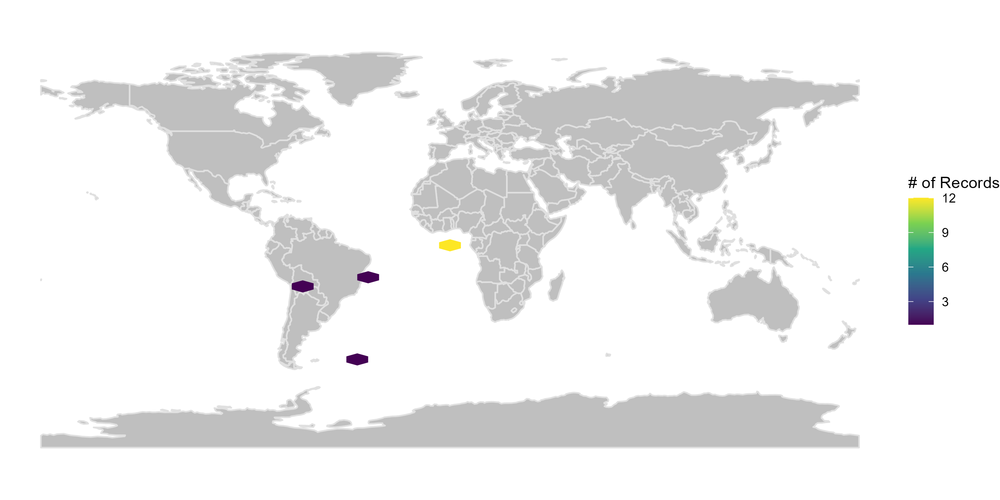
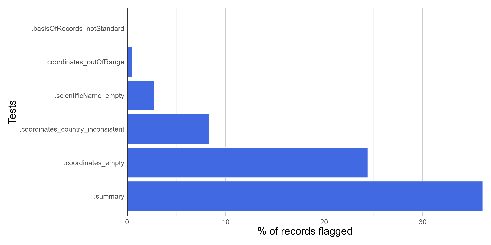

```{r include = FALSE}
knitr::opts_chunk$set(
  collapse = TRUE,
  comment = "#>",
  fig.path = "man/figures/README-",
  out.width = "100%",
  echo = TRUE,
  warning = FALSE,
  eval = TRUE
)
```

```{r, echo = FALSE, eval = TRUE, include = FALSE, messages = FALSE}
library(bdc)
if (!requireNamespace("rnaturalearthhires", quietly = TRUE))
  remotes::install_github("ropensci/rnaturalearthhires")
```

#### **Introduction**

Large and heterogeneous datasets may contain thousands of records missing spatial or taxonomic information (partially or entirely) as well as several records outside a region of interest or from doubtful sources. Such lower quality data are not fit for use in many research applications without prior amendments. The 'Pre-filter' module contains a series of **tests to detect, remove, and, whenever, possible, correct such erroneous or suspect records**.

#### **Installation**

Check [**here**](https://brunobrr.github.io/bdc/) how to install the bdc package

#### **Reading the database**

Read the merged database created in the module **Standardization and integration of different datasets** of the *bdc* package. It is also possible to read any datasets containing the **required** fields to run the functions (more details [here](https://brunobrr.github.io/bdc/articles/integrate_datasets.html)).

```{r echo=TRUE, eval=FALSE}
database <-
  readr::read_csv(here::here("Output/Intermediate/00_merged_database.csv"))
```

```{r echo=FALSE, eval=TRUE}
database <-
  readr::read_csv(system.file("extdata/outpus_vignettes/00_merged_database.csv", package = "bdc"), show_col_types = FALSE)
```

```{r echo=F, message=FALSE, warning=FALSE, eval=T}
DT::datatable(
  database, class = 'stripe', extensions = 'FixedColumns',
  options = list(
    pageLength = 5,
    dom = 'Bfrtip',
    scrollX = TRUE,
    fixedColumns = list(leftColumns = 2)
  )
)
# knitr::kable(database)
```

**IMPORTANT**:

The results of the **VALIDATION** test used to flag data quality are appended in separate fields in this database and retrieved as TRUE ( ✅ ok ) or **FALSE** (❌check carefully ).

#### **1 - Records missing species names**

*VALIDATION*. Flag records missing species names.

```{r}
check_pf <-
  bdc_scientificName_empty(
  data = database,
  sci_name = "scientificName")
```

#### **2 - Records lacking information on geographic coordinates**

*VALIDATION*. Flag records missing partial or complete information on geographic coordinates.

```{r}
check_pf <- bdc_coordinates_empty(
  data = check_pf,
  lat = "decimalLatitude",
  lon = "decimalLongitude")
```

#### **3 - Records with out-of-range coordinates**

*VALIDATION*. This test flags records with out-of-range coordinates: latitude \> 90 or -90; longitude \>180 or -180.

```{r}
check_pf <- bdc_coordinates_outOfRange(
  data = check_pf,
  lat = "decimalLatitude",
  lon = "decimalLongitude")
```

#### **4 - Records from doubtful sources**

*VALIDATION*. This test flags records from doubtful source. For example, records from drawings, photographs, or multimedia objects, fossil records, among others.

```{r}
# Check record sources of your dataset using:
check_pf %>% dplyr::group_by(basisOfRecord) %>% dplyr::summarise(n = dplyr::n())

check_pf <- bdc_basisOfRecords_notStandard(
  data = check_pf,
  basisOfRecord = "basisOfRecord",
  names_to_keep = "all")

```

#### **5 - Getting country names from valid coordinates**

*ENRICHMENT*. Deriving country names for records missing country names.

```{r}
check_pf <- bdc_country_from_coordinates(
  data = check_pf,
  lat = "decimalLatitude",
  lon = "decimalLongitude",
  country = "country")
```

#### **6 - Standardizing country names and getting country code information**

*ENRICHMENT*. Country names are standardized against a list of country names in several languages retrieved from Wikipedia.

```{r}
check_pf <- bdc_country_standardized(
  data = check_pf,
  country = "country"
)
```

#### **7 - Correcting latitude and longitude transposed**

*AMENDMENT*. The mismatch between informed country and coordinates can be the result of negative or transposed coordinates. Once detected a mismatch, different coordinate transformations are made to correct the country and coordinates mismatch. Verbatim coordinates are then replaced by the rectified ones in the returned database (a database containing verbatim and corrected coordinates is also created in the "Output" folder). Records near countries coastline are not tested to avoid incur in false positives.

```{r echo=TRUE, eval=F}
check_pf <-
  bdc_coordinates_transposed(
    data = check_pf,
    id = "database_id",
    sci_names = "scientificName",
    lat = "decimalLatitude",
    lon = "decimalLongitude",
    country = "country_suggested",
    countryCode = "countryCode",
    border_buffer = 0.2 # in decimal degrees (~22 km at the equator)
  )
```

#### **8 - Records outside a region of interest**

*VALIDATION*. Records outside one or multiple reference countries; i.e., records in other countries or at an informed distance from the coast (e.g., in the ocean). This last step avoids flagging as invalid records close to country limits (e.g., records of coast or marshland species).

```{r}
check_pf <-
  bdc_coordinates_country_inconsistent(
    data = check_pf,
    country_name = "Brazil",
    lon = "decimalLongitude",
    lat = "decimalLatitude",
    dist = 0.1 # in decimal degrees (~11 km at the equator)
  )
```

#### **9 - Identifying records not geo-referenced but containing locality information**

*ENRICHMENT*. Coordinates can be derived from a detailed description of the locality associated with records in a process called retrospective geo-referencing.

```{r}
xyFromLocality <- bdc_coordinates_from_locality(
  data = check_pf,
  locality = "locality",
  lon = "decimalLongitude",
  lat = "decimalLatitude"
)
```

#### **Report**

Here we create a column named ".summary" summing up the results of all **VALIDATION** tests (those starting with "."). This column is **FALSE** when a record is flagged as FALSE in any data quality test (i.e. potentially invalid or suspect record).

```{r}
check_pf <- bdc_summary_col(data = check_pf)
```

```{r echo=F, message=FALSE, warning=FALSE, eval=FALSE}
# DT::datatable(
#   check_pf, class = 'stripe', extensions = 'FixedColumns',
#   options = list(
#     pageLength = 3,
#     dom = 'Bfrtip',
#     scrollX = TRUE,
#     fixedColumns = list(leftColumns = 2)
#   )
# )
```

Creating a report summarizing the results of all tests.

```{r}
report <-
  bdc_create_report(data = check_pf,
                    database_id = "database_id",
                    workflow_step = "prefilter")
report
```

#### **Figures**

Here we create figures (bar plots and maps) to make the interpretation of the results of data quality tests easier. See some examples below.

```{r eval = FALSE}
bdc_create_figures(data = check_pf,
                   database_id = "database_id",
                   workflow_step = "prefilter")
```

{width="20cm"}

```{r eval=F, echo=F}
{width="20cm"}
```

<br/>

{width="20cm"}

<br/>

#### **Filtering the database**

We can remove records flagged as erroneous or suspect to obtain a "clean" database. Records missing names or coordinates, outside a region of interest or from distrustful sources are rarely suitable for biodiversity analyses. We can use the column **.summary** to filter valid records passing in all tests (i.e., flagged as "TRUE"). Next, we use the *bdc_filter_out_falgs* function to remove all tests' columns (that is, those starting with ".").

```{r}
output <-
  check_pf %>%
  dplyr::filter(.summary == TRUE) %>%
  bdc_filter_out_flags(data = ., col_to_remove = "all")
```

#### **Saving the database**

```{r}
# use qs::qread() to save the database in a compressed format
output %>%
  readr::write_csv(.,
            here::here("Output", "Intermediate", "01_prefilter_database.csv"))
```
