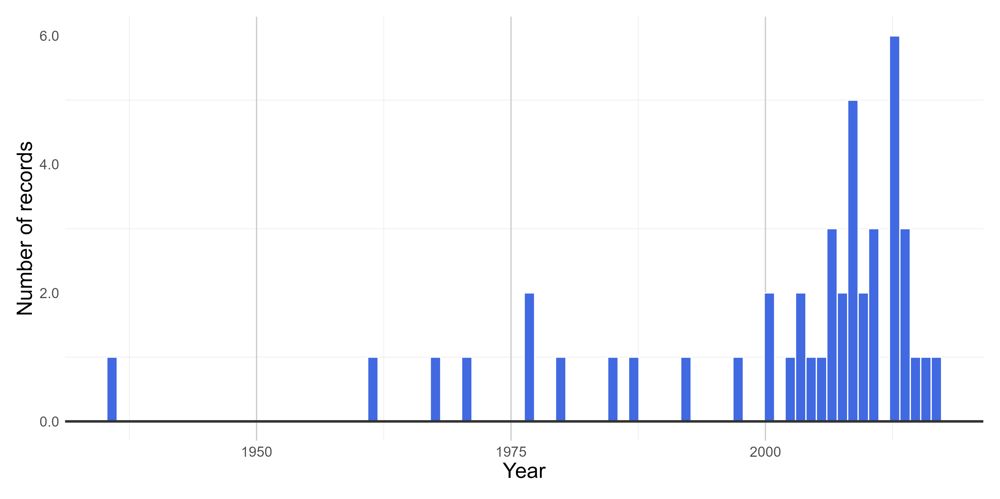
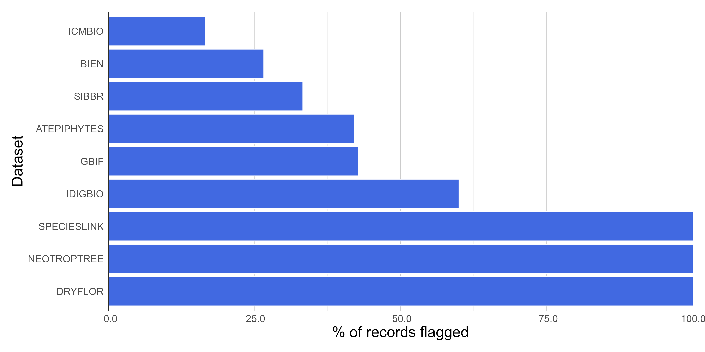
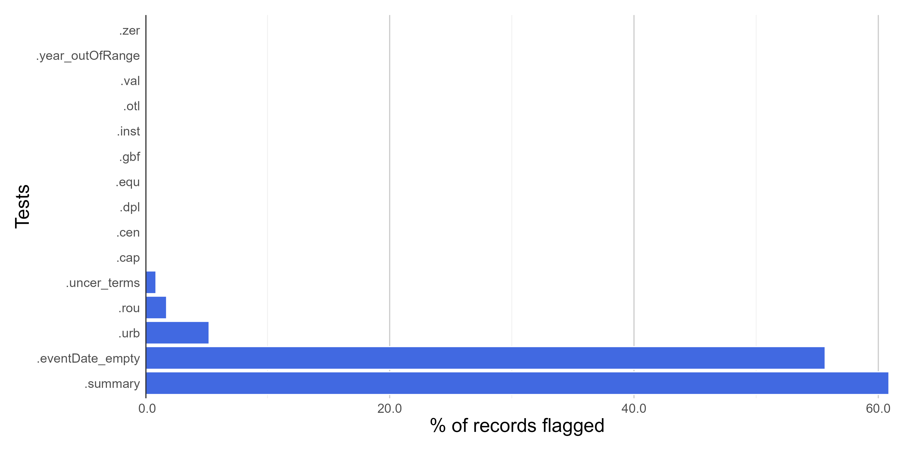

```{r include = FALSE}
knitr::opts_chunk$set(
  collapse = TRUE,
  comment = "#>",
  fig.path = "man/figures/README-",
  out.width = "100%",
  echo = TRUE,
  warning = FALSE,
  eval = T
)
```

```{r, echo = FALSE, eval = TRUE, include = FALSE, messages = FALSE}
library(bdc)
```

#### **Introduction**

This module of the *bdc* package extracts the collection year whenever possible from complete and legitimate date information and flags dubious (e.g., 07/07/10), illegitimate (e.g., 1300, 2100), or not supplied (e.g., 0 or NA) collecting year.

#### **Installation**

Check [**here**](https://brunobrr.github.io/bdc/) how to install the bdc package

#### **Reading the database**

Read the database created in the [**Space**](https://brunobrr.github.io/bdc/articles/space.html) module of the `bdc` package. It is also possible to read any datasets containing the \*\*required\*\* fields to run the funtion (more details [here](https://brunobrr.github.io/bdc/articles/integrate_datasets.html)).

```{r echo=TRUE, eval=FALSE}
database <-
  readr::read_csv(here::here("Output/Intermediate/03_space_database.csv"))
```

```{r echo=FALSE, eval=TRUE}
database <-
  readr::read_csv(system.file("extdata/outpus_vignettes/03_space_database.csv", package = "bdc"), show_col_types = FALSE)
```

```{r echo=F, message=FALSE, warning=FALSE}
DT::datatable(
  database, class = 'stripe', extensions = 'FixedColumns',
  options = list(
    pageLength = 3,
    dom = 'Bfrtip',
    scrollX = TRUE,
    fixedColumns = list(leftColumns = 2)
  )
)
```

IMPORTANT:

The results of the VALIDATION test used to flag data quality are appended in separate fields in this database and retrieved as TRUE ( ✅ ok ) or FALSE (❌check carefully ).

#### **1 - Records lacking event date information**

*VALIDATION*. This function flags records lacking event date information (e.g., empty or NA).

```{r}
check_time <-
  bdc_eventDate_empty(data = database, eventDate = "verbatimEventDate")
```

#### **2 - Extract year from event date**

*ENRICHMENT*. This function extracts four-digit years from unambiguously interpretable collecting dates.

```{r}
check_time <-
  bdc_year_from_eventDate(data = check_time, eventDate = "verbatimEventDate")
```

#### **3 - Records with out-of-range collecting year**

*VALIDATION*. This function identifies records with illegitimate or potentially imprecise collecting years. The year provided can be out-of-range (e.g., in the future) or collected before a specified year supplied by the user (e.g., 1900). Older records are more likely to be imprecise due to the locality-derived geo-referencing process.

```{r}
check_time <-
  bdc_year_outOfRange(data = check_time,
                      eventDate = "year",
                      year_threshold = 1900)
```

#### **Report**

Here we create a column named **.summary** summing up the results of all **VALIDATION** tests. This column is **FALSE** when a record is flagged as FALSE in any data quality test (i.e. potentially invalid or suspect record).

```{r}
check_time <- bdc_summary_col(data = check_time)
```

Creating a report summarizing the results of all tests of the `bdc` package.

```{r}
report <-
  bdc_create_report(data = check_time,
                    database_id = "database_id",
                    workflow_step = "time")

report
```

#### **Figures**

Here we create a histogram showing the number of records collecting over the years.

```{r eval = FALSE}
bdc_create_figures(data = check_time,
                   database_id = "database_id",
                   workflow_step = "time")
```

<br/>

{width="20cm"}

<br/>

{width="20cm"}

<br/>

{width="20cm"}

<br/>

#### **Saving a "raw" database**

Save the original database containing the results of all data quality tests appended in separate columns.

```{r}
check_time %>%
  readr::write_csv(.,
            here::here("Output", "Intermediate", "04_time_raw_database.csv"))
```

#### **Filtering the database**

Let's remove potentially erroneous or suspect records flagged by the data quality tests applied in all modules of the *bdc* package to get a "clean", "fitness-for-use" database. Note that **29%** (2,631 out of 9.000 records) of original records were considered "fitness-for-use" after the data-cleaning process.

```{r}
output <-
  check_time %>%
  dplyr::filter(.summary == TRUE) %>%
  bdc_filter_out_flags(data = ., col_to_remove = "all")
```

#### **Saving a clean "fitness-for-use" database**

```{r}
output %>%
  readr::write_csv(.,
            here::here("Output", "Intermediate", "04_time_clean_database.csv"))
```

```{r echo=F, message=FALSE, warning=FALSE}
DT::datatable(
  output, class = 'stripe', extensions = 'FixedColumns',
  options = list(
    pageLength = 3,
    dom = 'Bfrtip',
    scrollX = TRUE,
    fixedColumns = list(leftColumns = 2)
  )
)
#knitr::kable(output)
```
